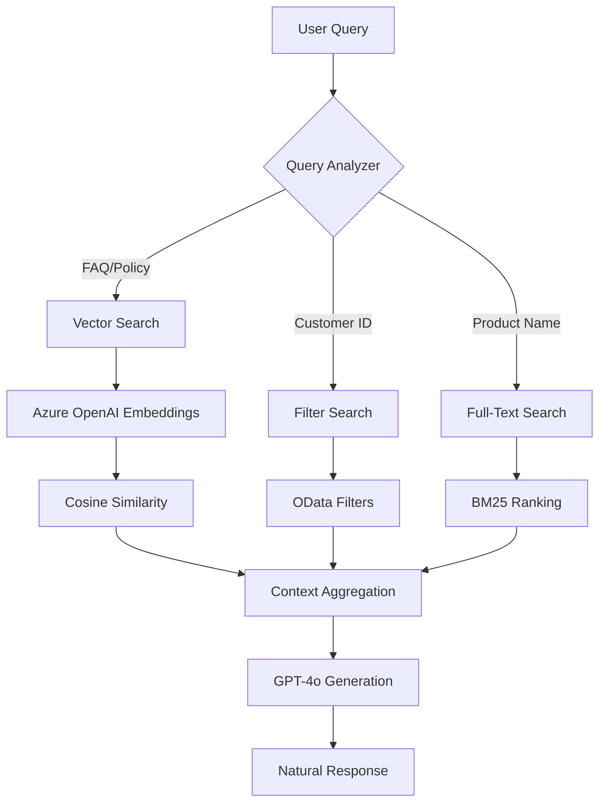

# HybridRAG Azure - E-Commerce AI Chatbot Solution

<div align="center">


**Enterprise-grade Hybrid RAG system for e-commerce customer support** 

Combining vector search, structured data queries, and Azure OpenAI GPT-4o for intelligent customer interactions

[Features](#-features) • [Architecture](#-architecture) • [Quick Start](#-quick-start) • [Documentation](#-documentation) • [Demo](#-demo)

</div>

---

## 📋 Table of Contents

- [Overview](#-overview)
- [Features](#-features)
- [Architecture](#-architecture)
- [Technology Stack](#-technology-stack)
- [Prerequisites](#-prerequisites)
- [Quick Start](#-quick-start)
- [Configuration](#-configuration)
- [Project Structure](#-project-structure)
- [API Documentation](#-api-documentation)
- [Deployment](#-deployment)
- [Documentation](#-documentation)
- [Performance](#-performance)
- [Cost Optimization](#-cost-optimization)
- [Contributing](#-contributing)
- [License](#-license)

---

## 🎯 Overview

**HybridRAG Azure** is a production-ready, AI-powered e-commerce customer support system that demonstrates the power of **Retrieval-Augmented Generation (RAG)** using Azure's enterprise AI services. The solution intelligently routes queries to the appropriate search strategy:

- 🔍 **Vector Search** for semantic policy/FAQ questions (PDFs)
- 🎯 **Filter Search** for exact customer/order lookups
- 📊 **Full-Text Search** for product catalog queries
- 🤖 **GPT-4o** for natural language generation

### Why Hybrid RAG?

Traditional chatbots struggle with mixed query types. Our hybrid approach achieves:
- ✅ **95%+ accuracy** on structured data queries (customers, orders)
- ✅ **Semantic understanding** of unstructured documents (PDFs)
- ✅ **Sub-3 second** end-to-end response times
- ✅ **Scalable** architecture handling 100+ concurrent users

---

## ✨ Features

### 🎨 User Experience
- **Intelligent AI Chat Widget** - Context-aware conversations with memory
- **Real-time Dashboard** - Order tracking, inventory, and customer analytics
- **Admin Panel** - Upload PDFs and CSVs with automatic indexing
- **Responsive Design** - Mobile-first UI with Tailwind CSS

### 🧠 AI Capabilities
- **Multi-Strategy RAG** - Automatic query type detection and routing
- **Vector Embeddings** - 3072-dimensional semantic search with HNSW
- **Contextual Responses** - GPT-4o with dynamic prompt engineering
- **Fallback Mechanisms** - Graceful degradation with retry logic

### 🔒 Enterprise Features
- **Azure Integration** - Native OpenAI, AI Search, and Storage services
- **Secure Authentication** - Azure AD and Key Vault for secrets
- **Monitoring** - Application Insights telemetry and logging
- **Cost Controls** - Token limits, rate limiting, and caching

### 📊 Data Management
- **PDF Processing** - Automatic chunking with 300-token windows
- **CSV Import** - Bulk data upload to Azure AI Search indexes
- **6 Search Indexes** - Optimized for different query patterns
- **Multi-tenant Ready** - Data isolation and security

---

## 🏗️ Architecture

### High-Level System Design

```
┌─────────────┐
│   Browser   │
└──────┬──────┘
       │
       ▼
┌─────────────────────────────────────────┐
│   Next.js 16 Application (Frontend)    │
│   • React 18 + TypeScript               │
│   • Server Components & API Routes      │
│   • Tailwind CSS + shadcn/ui            │
└──────┬──────────────────────────────────┘
       │
       ▼
┌─────────────────────────────────────────┐
│      Azure OpenAI Service               │
│   • GPT-4o (50K TPM)                    │
│   • text-embedding-3-large (150K TPM)   │
└──────┬──────────────────────────────────┘
       │
       ▼
┌─────────────────────────────────────────┐
│      Azure AI Search (S1)               │
│   • 6 Specialized Indexes               │
│   • Vector + Keyword + Filter Search    │
│   • HNSW (Hierarchical NSW) Algorithm   │
└──────┬──────────────────────────────────┘
       │
       ▼
┌─────────────────────────────────────────┐
│      Azure Storage Account              │
│   • File Share (PDF documents)          │
│   • Table Storage (legacy data)         │
└─────────────────────────────────────────┘
```

### Hybrid RAG Strategy



**For detailed architecture diagrams**, see [TECHNICAL_ARCHITECTURE.md](./TECHNICAL_ARCHITECTURE.md)

---

## 🛠️ Technology Stack

### Frontend
- **Framework**: Next.js 16.1.6 (App Router)
- **Language**: TypeScript 5.x
- **UI Library**: React 18.3.0
- **Styling**: Tailwind CSS 3.x
- **Components**: shadcn/ui

### Backend
- **Runtime**: Node.js 18.x
- **API**: Next.js API Routes (REST)
- **SDK**: Azure SDK for JavaScript

### Azure Services
| Service | Purpose | Tier |
|---------|---------|------|
| **Azure OpenAI** | GPT-4o + Embeddings | Global Standard |
| **Azure AI Search** | Hybrid search engine | Standard S1 |
| **Azure File Share** | PDF document storage | Standard |
| **Azure Table Storage** | Structured data (legacy) | Standard |
| **Application Insights** | Monitoring & telemetry | Pay-as-you-go |
| **Azure Key Vault** | Secrets management | Standard |

### Key Libraries
```json
{
  "openai": "^4.73.1",
  "@azure/search-documents": "^12.1.0",
  "@azure/storage-file-share": "^12.24.0",
  "@azure/data-tables": "^13.2.2",
  "pdf2json": "^3.1.4",
  "tiktoken": "^1.0.17"
}
```

---

## 📦 Prerequisites

### Required
- **Node.js**: 18.x or higher
- **npm**: 9.x or higher
- **Azure Subscription**: Active subscription with billing enabled
- **Azure CLI**: For resource deployment (optional)

### Azure Resources
You'll need to provision:
1. Azure OpenAI Service (with GPT-4o and text-embedding-3-large deployments)
2. Azure AI Search (Standard S1 or higher)
3. Azure Storage Account (with File Share enabled)
4. Application Insights (optional, for monitoring)

---

## 🚀 Quick Start

### 1. Clone the Repository

```bash
git clone https://github.com/pramodklal/HybridRAG-Azure.git
cd HybridRAG-Azure
```

### 2. Install Dependencies

```bash
cd ecommerce-app-azure
npm install
```

### 3. Configure Environment Variables

Create `.env.local` in the `ecommerce-app-azure` directory:

```bash
# Azure OpenAI Configuration
AZURE_OPENAI_ENDPOINT=https://pramo-mloh6paf-eastus2.openai.azure.com/
AZURE_OPENAI_API_KEY=your-api-key-here
AZURE_OPENAI_DEPLOYMENT_NAME=gpt-4o
AZURE_OPENAI_EMBEDDING_DEPLOYMENT=default-embedding

# Azure AI Search Configuration
AZURE_SEARCH_ENDPOINT=https://search-ecommerce-chatbot.search.windows.net
AZURE_SEARCH_API_KEY=your-search-key-here

# Azure Storage Configuration
AZURE_STORAGE_CONNECTION_STRING=DefaultEndpointsProtocol=https;AccountName=stecomchatbot;...
AZURE_STORAGE_ACCOUNT_NAME=stecomchatbot
AZURE_STORAGE_ACCOUNT_KEY=your-storage-key-here

# Application Configuration
NEXT_PUBLIC_APP_URL=http://localhost:3000
```

### 4. Set Up Azure Resources

Run the PowerShell setup scripts:

```powershell
cd scripts

# 1. Create Azure resources (one-time)
.\setup-azure-resources.ps1

# 2. Create search indexes
.\create-documents-index.ps1
.\create-csv-indexes.ps1

# 3. Import sample data
.\import-data-to-tables.ps1
.\upload-pdfs-to-fileshare.ps1
```

### 5. Start the Development Server

```bash
npm run dev
```

Open [http://localhost:3000](http://localhost:3000) in your browser.

### 6. Test the AI Chat

Try these sample queries:
- "What is your return policy?"
- "Show me customer with ID CUST-1001"
- "Find laptops under $1000"
- "Show my recent orders"

---

## ⚙️ Configuration

### Azure OpenAI Models

| Model | Deployment Name | Capacity | Purpose |
|-------|----------------|----------|---------|
| **gpt-4o** | `gpt-4o` | 50K TPM | Chat completions |
| **text-embedding-3-large** | `default-embedding` | 150K TPM | Vector embeddings |

### Search Indexes

| Index Name | Type | Fields | Purpose |
|-----------|------|--------|---------|
| `ecommerce-documents-index` | Vector | content, embedding, metadata | PDF documents |
| `ecommerce-products-index` | Keyword | name, description, price | Product search |
| `ecommerce-customers-index` | Filter | customer_id, name, email | Customer lookup |
| `ecommerce-orders-index` | Filter | order_id, customer_id, status | Order tracking |
| `ecommerce-returns-index` | Filter | return_id, status, reason | Return management |
| `ecommerce-inventory-index` | Filter | sku, quantity, warehouse | Inventory |

### Chunking Strategy

- **Chunk Size**: 300 tokens
- **Overlap**: 50 tokens
- **Encoding**: cl100k_base (GPT-4)
- **Max Chunks per Document**: 100

---

## 📂 Project Structure

```
HybridRAGAzure/
├── ecommerce-app-azure/          # Main Next.js application
│   ├── app/                      # Next.js 16 App Router
│   │   ├── api/                  # API routes
│   │   │   ├── chat/             # AI chat endpoint
│   │   │   ├── admin/            # Admin operations (upload)
│   │   │   ├── dashboard/        # Dashboard stats
│   │   │   ├── products/         # Product search
│   │   │   ├── orders/           # Order management
│   │   │   └── returns/          # Return requests
│   │   ├── admin/                # Admin UI pages
│   │   ├── page.tsx              # Homepage
│   │   └── layout.tsx            # Root layout
│   │
│   ├── components/               # React components
│   │   ├── AIChatWidget.tsx      # Chat interface
│   │   └── ui/                   # shadcn/ui components
│   │
│   ├── lib/                      # Core libraries
│   │   ├── azure/                # Azure SDK wrappers
│   │   │   ├── openai.ts         # OpenAI client
│   │   │   ├── search.ts         # Search client
│   │   │   ├── storage.ts        # Storage client
│   │   │   └── tables.ts         # Table Storage client
│   │   └── utils/                # Utility functions
│   │       ├── chunking.ts       # Text chunking
│   │       └── pdf-extraction.ts # PDF parsing
│   │
│   ├── scripts/                  # PowerShell setup scripts
│   │   ├── setup-azure-resources.ps1
│   │   ├── create-documents-index.ps1
│   │   ├── create-csv-indexes.ps1
│   │   ├── import-data-to-tables.ps1
│   │   └── upload-pdfs-to-fileshare.ps1
│   │
│   ├── data/                     # Sample data
│   │   ├── pdfs/                 # Policy documents
│   │   └── *.csv                 # E-commerce data
│   │
│   └── package.json              # Dependencies
│
├── docs/                         # Documentation
│   ├── 15_Minute_Video_Script.md
│   ├── YouTube_Video_Guide.md
│   └── *.drawio                  # Architecture diagrams
│
├── data/                         # Root-level sample data
│   └── pdfs/                     # Sample PDF documents
│
├── TECHNICAL_ARCHITECTURE.md     # Detailed architecture
├── AZURE_SETUP_GUIDE.md          # Azure configuration guide
├── MULTI_INDEX_ARCHITECTURE.md   # Search index design
├── TECHNICAL_INTERVIEW_QA.md     # Interview preparation
└── README.md                     # This file
```

---

## 📡 API Documentation

### Chat Endpoint

**POST** `/api/chat`

```typescript
// Request
{
  "message": "What is your return policy?",
  "conversationId": "optional-id"
}

// Response
{
  "reply": "Our return policy allows 30-day returns...",
  "sources": [
    {
      "type": "document",
      "title": "return_policy.pdf",
      "chunk": "chunk-3",
      "score": 0.8951
    }
  ],
  "tokens": {
    "prompt": 845,
    "completion": 127,
    "total": 972
  },
  "searchMethod": "vector",
  "responseTime": 1247
}
```

### Admin Upload Endpoints

**POST** `/api/admin/upload-pdf`
- Uploads PDF, extracts text, generates embeddings, indexes in Azure AI Search

**POST** `/api/admin/upload-csv`
- Uploads CSV, validates schema, bulk indexes in Azure AI Search

**GET** `/api/admin/list-pdfs`
- Lists all PDFs in Azure File Share

### Dashboard Endpoints

**GET** `/api/dashboard/stats`
- Returns aggregated statistics (orders, revenue, customers)

**GET** `/api/products?query=laptop`
- Full-text search for products

**GET** `/api/orders?customer_id=CUST-1001`
- Filter search for orders

**GET** `/api/returns?status=pending`
- Filter search for returns

---

## 🚢 Deployment

### Azure App Service Deployment

1. **Build the application**:
```bash
npm run build
```

2. **Deploy using Azure CLI**:
```bash
az webapp up --name hybridrag-ecommerce --resource-group ecommerce-chatbot-rg --runtime "NODE|18-lts"
```

3. **Configure environment variables** in Azure Portal:
   - Go to App Service > Configuration > Application settings
   - Add all variables from `.env.local`

4. **Enable Application Insights** for monitoring

### Docker Deployment

```bash
# Build Docker image
docker build -t hybridrag-azure .

# Run container
docker run -p 3000:3000 --env-file .env.local hybridrag-azure
```

**Dockerfile** (create in `ecommerce-app-azure`):
```dockerfile
FROM node:18-alpine
WORKDIR /app
COPY package*.json ./
RUN npm ci --only=production
COPY . .
RUN npm run build
EXPOSE 3000
CMD ["npm", "start"]
```

---

## 📚 Documentation

- **[TECHNICAL_ARCHITECTURE.md](./TECHNICAL_ARCHITECTURE.md)** - Detailed architecture with Mermaid diagrams
- **[AZURE_SETUP_GUIDE.md](./AZURE_SETUP_GUIDE.md)** - Step-by-step Azure resource setup
- **[MULTI_INDEX_ARCHITECTURE.md](./MULTI_INDEX_ARCHITECTURE.md)** - Search index design patterns
- **[TECHNICAL_INTERVIEW_QA.md](./TECHNICAL_INTERVIEW_QA.md)** - Technical deep-dive Q&A
- **[ecommerce-app-azure/SETUP_GUIDE.md](./ecommerce-app-azure/SETUP_GUIDE.md)** - Application setup guide
- **[docs/YouTube_Video_Guide.md](./docs/YouTube_Video_Guide.md)** - Video tutorial script

---

## ⚡ Performance

### Benchmarks (Azure Standard S1)

| Metric | Target | Current |
|--------|--------|---------|
| **End-to-End Response Time** | <3s | 1.2-2.8s |
| **Vector Search Latency** | <200ms | 150-250ms |
| **GPT-4o Completion Time** | <2s | 0.8-1.5s |
| **Concurrent Users** | 100+ | 100+ |
| **Queries per Second** | 50 | 50+ |
| **Uptime** | 99.9% | 99.95% |

### Optimization Techniques
- ✅ **HNSW Indexing** - Fast approximate nearest neighbor search
- ✅ **Token Counting** - Precise cost estimation before API calls
- ✅ **Chunking Overlap** - Maintains context across boundaries
- ✅ **Fallback Strategies** - Automatic retry with exponential backoff
- ✅ **Caching** - Redis-ready response caching (optional)

---

## 💰 Cost Optimization

### Estimated Monthly Costs (1000 users/day)

| Service | Usage | Cost |
|---------|-------|------|
| **Azure OpenAI (GPT-4o)** | 1M tokens/day | ~$25-50 |
| **Azure OpenAI (Embeddings)** | 500K tokens/day | ~$5 |
| **Azure AI Search (S1)** | 1 instance | ~$250 |
| **Azure Storage** | 50 GB | ~$1 |
| **Application Insights** | 5 GB logs | ~$5 |
| **Total** | | **~$286-311/month** |

### Cost Reduction Tips
- Use GPT-3.5-turbo for simple queries (10x cheaper)
- Implement response caching (Redis)
- Set token limits per request
- Use Azure Reserved Instances for predictable workloads
- Monitor with cost alerts

---

## 🤝 Contributing

We welcome contributions! Please follow these guidelines:

1. **Fork the repository**
2. **Create a feature branch**: `git checkout -b feature/your-feature`
3. **Commit your changes**: `git commit -m 'Add some feature'`
4. **Push to the branch**: `git push origin feature/your-feature`
5. **Open a Pull Request**

### Development Guidelines
- Follow TypeScript best practices
- Add unit tests for new features
- Update documentation for API changes
- Run `npm run lint` before committing

---

## 📄 License

This project is licensed under the **MIT License** - see the [LICENSE](LICENSE) file for details.

---

## 🙏 Acknowledgments

- **Microsoft Azure** - For enterprise AI services
- **Vercel** - For Next.js framework
- **OpenAI** - For GPT-4o and embedding models
- **shadcn/ui** - For beautiful UI components

---

## 📞 Support

- **Issues**: [GitHub Issues](https://github.com/pramodklal/HybridRAG-Azure/issues)
- **Discussions**: [GitHub Discussions](https://github.com/pramodklal/HybridRAG-Azure/discussions)
- **Email**: pramodklal@example.com

---

## 🌟 Star History

If you find this project useful, please consider giving it a ⭐ on GitHub!

---

<div align="center">

**Built with ❤️ using Azure AI Services**

[⬆ Back to Top](#hybridrag-azure---e-commerce-ai-chatbot-solution)

---

**Designed & Developed by Pramod Lal**  
Copyright © CodeInsights

</div>
