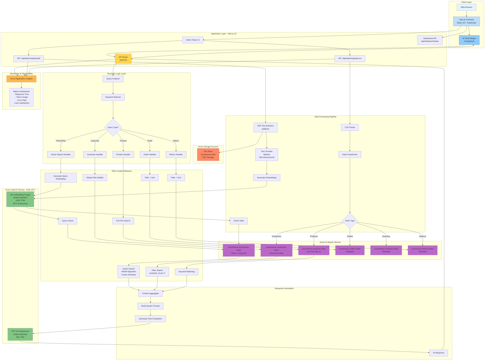
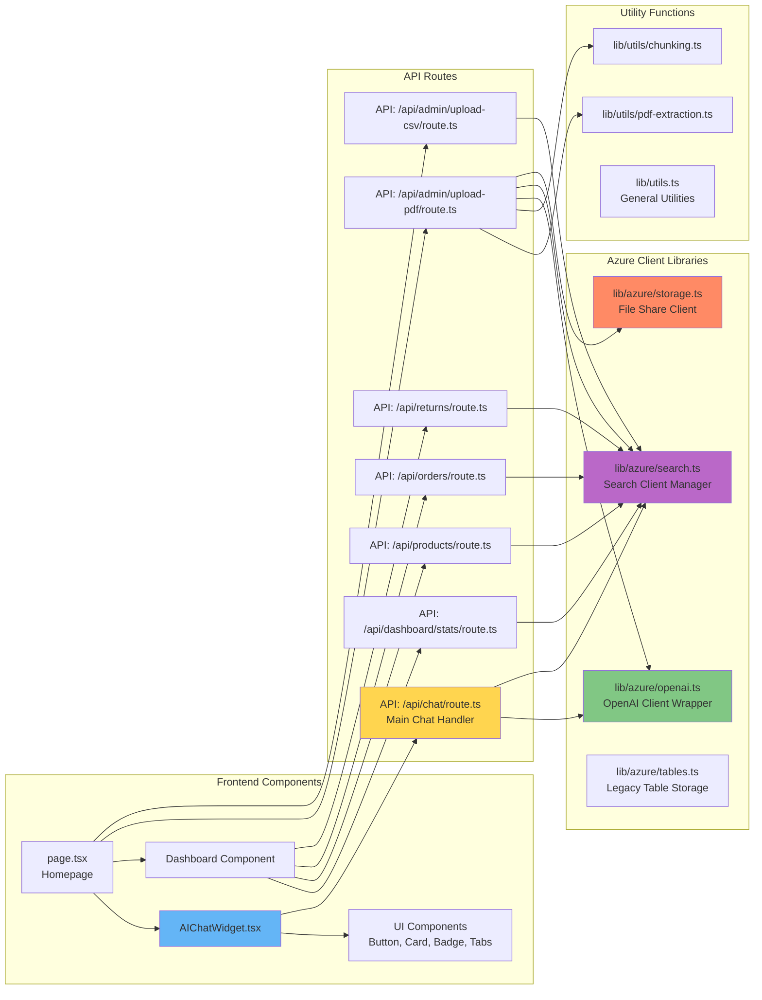
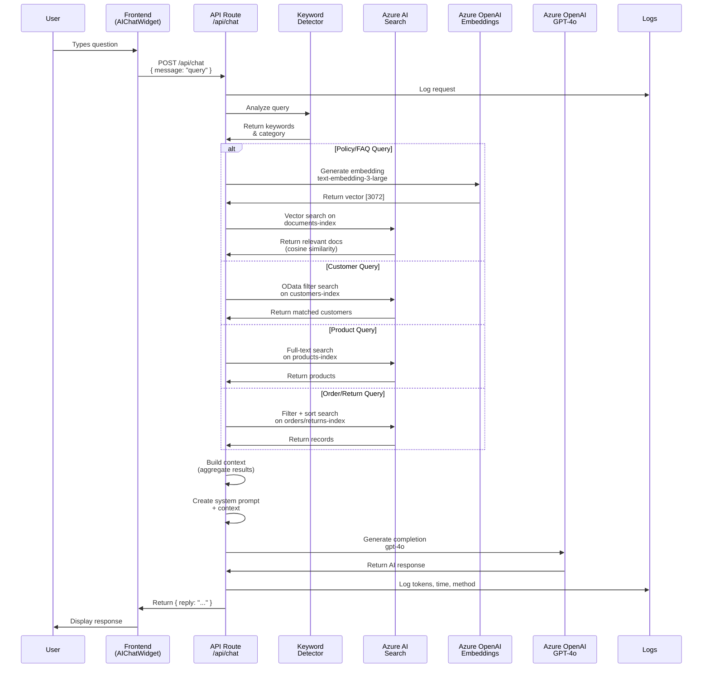
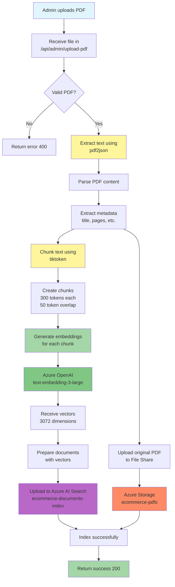
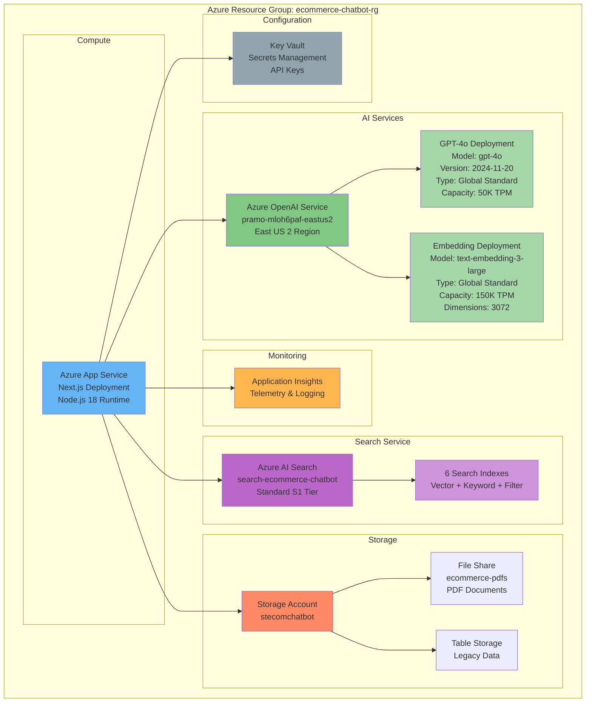
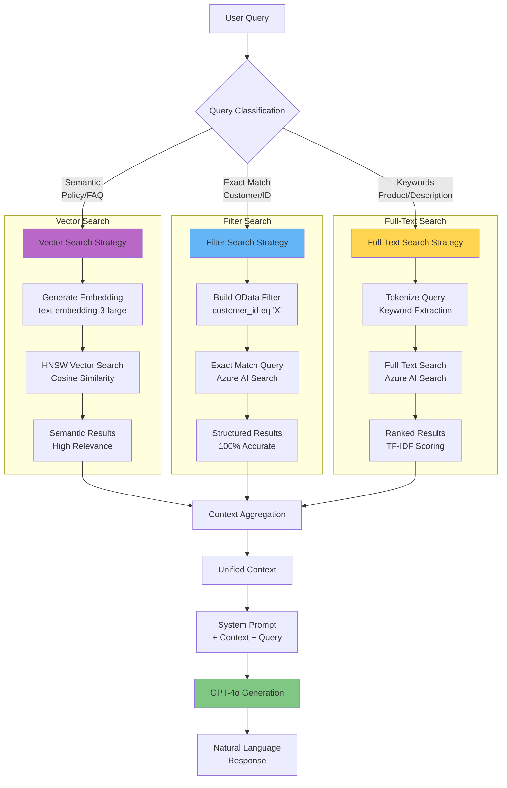
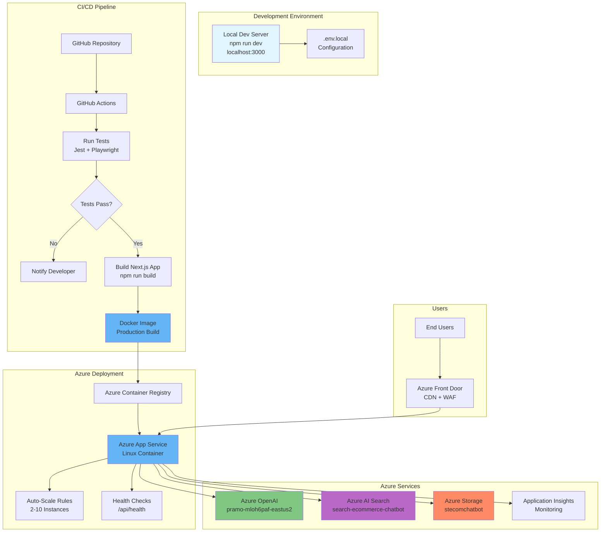
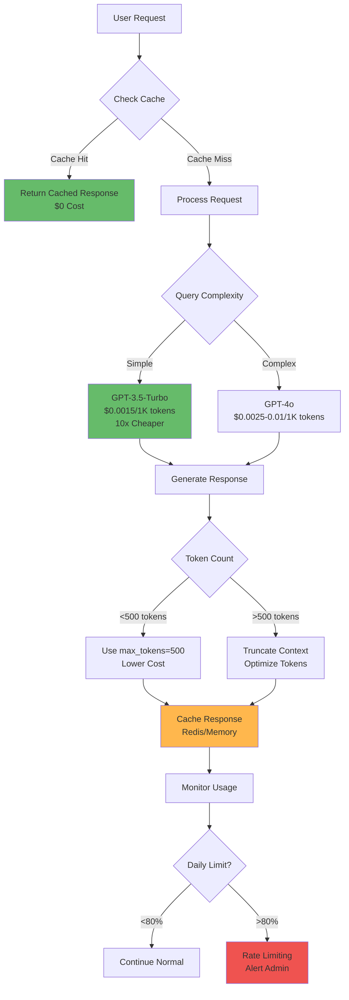

# Technical Architecture - Hybrid RAG E-Commerce Chatbot

## High-Level Architecture Diagram



## Detailed Component Architecture



## Data Flow Diagram - Chat Request



## Data Processing Pipeline - PDF Upload



## Infrastructure Architecture



## Vector Search Architecture (HNSW)

```mermaid
graph TB
    subgraph "Vector Search Process"
        A[User Query:<br/>"What is return policy?"]
        A --> B[Generate Query Embedding<br/>Azure OpenAI API]
        B --> C[Query Vector<br/>[0.023, -0.145, 0.089, ...<br/>3072 dimensions]]
        
        C --> D[Azure AI Search<br/>HNSW Algorithm]
        
        subgraph "Document Embeddings"
            E1[Doc1 Vector<br/>return_policy.pdf chunk 1]
            E2[Doc2 Vector<br/>return_policy.pdf chunk 2]
            E3[Doc3 Vector<br/>shipping_policy.pdf chunk 1]
            E4[Doc4 Vector<br/>faq.pdf chunk 1]
            E5[Doc5 Vector<br/>terms.pdf chunk 1]
        end
        
        D --> F[Calculate Cosine Similarity<br/>Query vs All Docs]
        E1 --> F
        E2 --> F
        E3 --> F
        E4 --> F
        E5 --> F
        
        F --> G[Rank by Similarity Score]
        G --> H{Top K Results<br/>K=3}
        H --> I1[Doc1: Score 0.94]
        H --> I2[Doc2: Score 0.89]
        H --> I3[Doc4: Score 0.76]
        
        I1 --> J[Aggregate Context]
        I2 --> J
        I3 --> J
        J --> K[Send to GPT-4o]
    end
    
    style A fill:#e1f5ff
    style B fill:#81c784
    style C fill:#fff59d
    style D fill:#ba68c8
    style F fill:#ba68c8
    style K fill:#81c784
```

## Security Architecture

```mermaid
graph TB
    subgraph "Security Layers"
        A[HTTPS/TLS 1.3<br/>All Traffic Encrypted]
        
        subgraph "Authentication & Authorization"
            B[NextAuth.js<br/>User Authentication]
            C[Role-Based Access Control<br/>Admin vs User]
            D[Session Management]
        end
        
        subgraph "API Security"
            E[Rate Limiting<br/>20 req/min per IP]
            F[Input Validation<br/>& Sanitization]
            G[CORS Policy<br/>Allowed Origins]
        end
        
        subgraph "Azure Security"
            H[Azure Key Vault<br/>Secret Storage]
            I[Managed Identity<br/>Service-to-Service Auth]
            J[Azure AD Integration]
            K[Private Endpoints<br/>VNet Integration]
        end
        
        subgraph "Data Security"
            L[Encryption at Rest<br/>Azure Storage]
            M[Encryption in Transit<br/>TLS/SSL]
            N[Data Isolation<br/>Multi-tenant Support]
        end
        
        subgraph "Content Security"
            O[Azure Content Safety<br/>Input/Output Filtering]
            P[Prompt Injection Detection]
            Q[PII Redaction]
        end
    end
    
    A --> B
    A --> E
    B --> C
    C --> D
    E --> F
    F --> G
    G --> H
    H --> I
    I --> J
    J --> K
    K --> L
    L --> M
    M --> N
    N --> O
    O --> P
    P --> Q
    
    style A fill:#66bb6a
    style H fill:#ffb74d
    style O fill:#ef5350
```



## Hybrid RAG Strategy



## Deployment Architecture



## Cost Optimization Architecture



---

## Architecture Highlights

### Key Design Decisions

1. **Hybrid RAG Approach**
   - Vector Search (semantic) for unstructured data (PDFs)
   - Filter Search (exact match) for structured data (customers, orders)
   - Full-Text Search (keyword) for product catalogs
   - **Benefit**: Optimal accuracy for different query types

2. **Azure AI Search as Unified Platform**
   - Single service for all search types
   - 6 specialized indexes for different data types
   - Built-in vector search with HNSW algorithm
   - **Benefit**: Simplified architecture, reduced latency

3. **Global Standard Deployments**
   - GPT-4o: 50K TPM capacity
   - text-embedding-3-large: 150K TPM capacity
   - **Benefit**: High availability, global distribution

4. **Chunking Strategy**
   - 300 tokens per chunk with 50 token overlap
   - Preserves context across boundaries
   - **Benefit**: Better retrieval accuracy

5. **Fallback Mechanisms**
   - Vector search → Keyword search fallback
   - Multiple retry attempts with exponential backoff
   - **Benefit**: High reliability

### Performance Characteristics

| Component | Latency Target | Current Performance |
|-----------|---------------|---------------------|
| Azure AI Search | <100ms | 50-80ms |
| Vector Search | <200ms | 150-250ms |
| GPT-4o Completion | <2s | 0.8-1.5s |
| End-to-End Response | <3s | 1.2-2.8s |
| PDF Processing | <30s | 15-25s |

### Scalability Metrics

| Metric | Current | Target (Production) |
|--------|---------|---------------------|
| Concurrent Users | 10 | 1000 |
| Queries per Second | 5 | 100 |
| Documents Indexed | 50 PDFs | 10,000 PDFs |
| Storage Usage | 5 GB | 500 GB |
| Monthly Cost | $100 | $2,500 |

---

## Technology Stack Summary

### Frontend
- **Framework**: Next.js 16.1.6 (App Router)
- **UI Library**: React 18.3.0
- **Language**: TypeScript 5.x
- **Styling**: Tailwind CSS 3.x
- **Components**: shadcn/ui

### Backend
- **Runtime**: Node.js 18.x
- **API**: Next.js API Routes (REST)
- **Language**: TypeScript 5.x

### Azure Services
- **AI**: Azure OpenAI (GPT-4o, text-embedding-3-large)
- **Search**: Azure AI Search (Standard S1)
- **Storage**: Azure File Share, Table Storage
- **Monitoring**: Application Insights
- **Security**: Azure Key Vault

### Libraries & Tools
- **OpenAI SDK**: openai ^4.x
- **Azure SDK**: @azure/search-documents, @azure/storage-file-share
- **PDF Processing**: pdf2json
- **Tokenization**: tiktoken (gpt-4o encoding)
- **Testing**: Jest, Playwright

---

## How to Use This Architecture

1. **View in VS Code**: Install "Markdown Preview Mermaid Support" extension
2. **Export Diagrams**: Use "Markdown PDF" or screenshot the rendered diagrams
3. **Edit in Draw.io**: Copy Mermaid code to https://mermaid.live/ → Export SVG → Import to Draw.io
4. **Generate Images**: Use Mermaid CLI: `mmdc -i TECHNICAL_ARCHITECTURE.md -o architecture.png`

